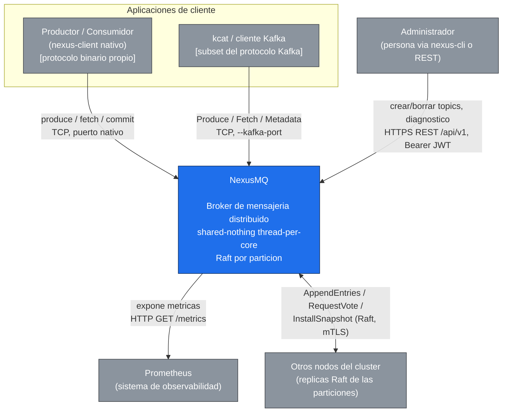

# Diagrama 1: Contexto del sistema (C4 nivel 1)

NexusMQ visto como una caja negra y los actores y sistemas externos que interactúan con él: productores y consumidores (cliente nativo y `kcat` por el subset Kafka), administradores (REST/CLI), Prometheus (scrape de `/metrics`) y los demás nodos del propio cluster.

