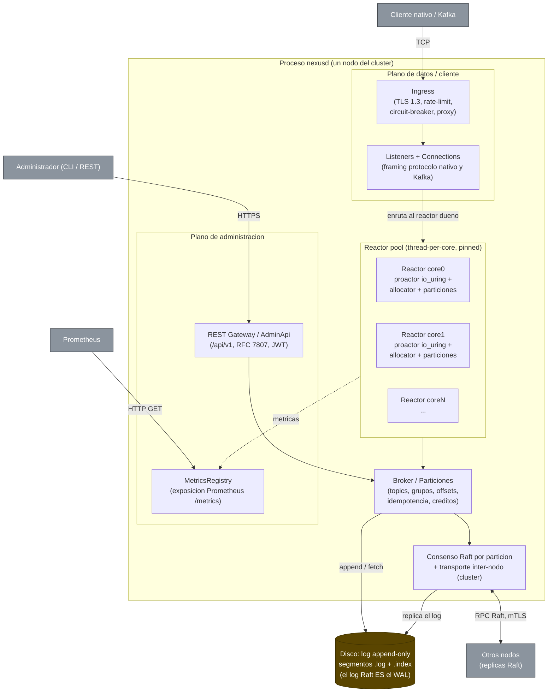

# Diagrama 2: Contenedores de un nodo (C4 nivel 2)

Vista interna de un proceso `nexusd`: los tres planos (datos/cliente, Raft inter-nodo y administración REST), el *reactor pool* thread-per-core que ejecuta la lógica del broker, y el almacenamiento append-only en disco. Cada reactor es dueño exclusivo de un subconjunto de réplicas de partición; la interacción entre núcleos es paso de mensajes (SPSC), nunca estado compartido.

