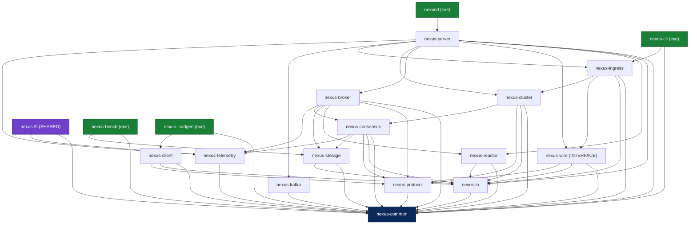

# Diagrama 3: Grafo de dependencias de targets

Dependencias internas entre las 15 librerías `nexus-*`, los ejecutables (`nexusd`, `nexus-cli`, `nexus-bench`, `nexus-loadgen`) y la librería compartida `nexus-ffi`. Refleja el grafo real de dependencias del proyecto: las capas suben de abajo (`nexus-common`, sin dependencias internas) hacia arriba (`nexus-server`/`nexus-client`). Regla forzada en CMake: un target nunca depende de otro de su misma capa o superior. Una flecha `A --> B` significa "A depende de B".

