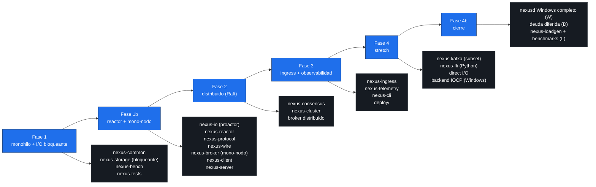

# Diagrama 4: Mapa fase → targets

Qué librerías y ejecutables se entregan en cada fase del plan de desarrollo. Las fases son incrementales: cada una se apoya en lo construido antes. Estado as-built: las fases 1→4 están implementadas, con el cierre 4b (Windows, deuda diferida y benchmarks).

## Tabla resumen

| Fase | Foco | Targets entregados |
|---|---|---|
| **1** | Monohilo + I/O bloqueante | `nexus-common`, `nexus-storage` (I/O bloqueante), `nexus-bench`, `nexus-tests` (unit/property/crash) |
| **1b** | Reactor + mono-nodo | `nexus-io` (proactor), `nexus-reactor`, `nexus-protocol`, `nexus-wire`, `nexus-broker` (mono-nodo), `nexus-client`, `nexus-server` (mono-nodo); tests de integración |
| **2** | Distribuido (Raft) | `nexus-consensus`, `nexus-cluster`, broker distribuido (grupos, rebalanceo); tests sim/chaos |
| **3** | Ingress + observabilidad | `nexus-ingress`, `nexus-telemetry`, `nexus-cli`, deploy/ (Docker, Prometheus, Grafana, k8s) |
| **4** | Stretch | direct I/O, `nexus-kafka` (subset), `nexus-ffi` (binding Python), backend IOCP (Windows) |
| **4b** | Cierre | bloque W (`nexusd` Windows completo), bloque D (deuda diferida), bloque L (`nexus-loadgen` + benchmarks) |

## Diagrama

