# Diagrama 5: Topología thread-per-core (shared-nothing)

Cómo NexusMQ materializa el modelo *shared-nothing thread-per-core* (ADR-0005): el `ReactorPool` crea N `Reactor`, uno por núcleo físico, y fija cada hilo a su núcleo (`pthread_setaffinity_np`). Cada `Reactor` es **dueño** de todo su estado reactor-local —su anillo io_uring (`Proactor`), su `ArenaAllocator`, su `CoroScheduler`, sus temporizadores y el subconjunto de réplicas de partición que le tocan (`p % N`)— y **no comparte nada mutable** con los demás. El único canal entre reactores es el paso de mensajes: cada reactor expone un `CrossCoreMailbox` con una cola `SpscQueue` lock-free por núcleo origen; `Reactor::submit_to` encola en la cola del destino y lo despierta (`Proactor::wake`). Así no hay locks ni *cache ping-pong* en el plano de datos.

```mermaid
graph TB
    pool["ReactorPool<br/>crea N reactores, los cablea (connect_peers) y los fija por afinidad"]

    subgraph core0["Núcleo 0 (hilo pinned)"]
        r0["Reactor 0<br/>poll_once / run"]
        p0["Proactor 0<br/>anillo io_uring propio"]
        a0["ArenaAllocator 0"]
        s0["CoroScheduler 0<br/>corrutinas listas"]
        rep0["Réplicas de partición:<br/>p donde p % N == 0"]
        mb0["CrossCoreMailbox 0<br/>N colas SPSC entrantes + wake"]
        r0 --> p0
        r0 --> a0
        r0 --> s0
        r0 --> rep0
        r0 --> mb0
    end

    subgraph core1["Núcleo 1 (hilo pinned)"]
        r1["Reactor 1<br/>poll_once / run"]
        p1["Proactor 1<br/>anillo io_uring propio"]
        a1["ArenaAllocator 1"]
        s1["CoroScheduler 1<br/>corrutinas listas"]
        rep1["Réplicas de partición:<br/>p donde p % N == 1"]
        mb1["CrossCoreMailbox 1<br/>N colas SPSC entrantes + wake"]
        r1 --> p1
        r1 --> a1
        r1 --> s1
        r1 --> rep1
        r1 --> mb1
    end

    subgraph coreN["Núcleo N-1 (hilo pinned)"]
        rN["Reactor N-1<br/>poll_once / run"]
        pN["Proactor N-1<br/>anillo io_uring propio"]
        aN["ArenaAllocator N-1"]
        sN["CoroScheduler N-1<br/>corrutinas listas"]
        repN["Réplicas de partición:<br/>p donde p % N == N-1"]
        mbN["CrossCoreMailbox N-1<br/>N colas SPSC entrantes + wake"]
        rN --> pN
        rN --> aN
        rN --> sN
        rN --> repN
        rN --> mbN
    end

    pool --> r0
    pool --> r1
    pool --> rN

    r0 -. "submit_to: SpscQueue + wake" .-> mb1
    r1 -. "submit_to: SpscQueue + wake" .-> mbN
    rN -. "submit_to: SpscQueue + wake" .-> mb0

    classDef pool fill:#1f6feb,stroke:#0b2a5b,color:#fff;
    classDef reactor fill:#238636,stroke:#0b3d1a,color:#fff;
    classDef local fill:#161b22,stroke:#30363d,color:#fff;
    classDef bridge fill:#8957e5,stroke:#3b1f6b,color:#fff;
    class pool pool;
    class r0,r1,rN reactor;
    class p0,a0,s0,rep0,p1,a1,s1,rep1,pN,aN,sN,repN local;
    class mb0,mb1,mbN bridge;
```

> Las flechas continuas son propiedad (cada reactor posee su estado local). Las flechas discontinuas son el **único** acoplamiento entre núcleos: trabajo movido por `submit_to` a la `SpscQueue` del buzón destino, seguido de un `wake`. Cada cola SPSC tiene un único productor (el núcleo origen) y un único consumidor (el reactor dueño), con `head_`/`tail_` en líneas de caché distintas (`alignas`) para evitar *false sharing*.
