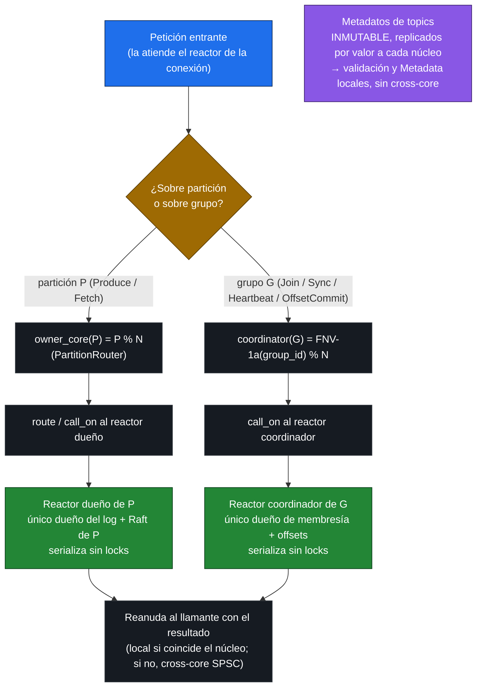

# Diagrama 6: Sharding del plano de datos por núcleo

Cómo se reparte el estado entre los N reactores sin compartir nada mutable (ADR-0026, sobre ADR-0005). Cada pieza de estado tiene un **dueño único**, lo que la hace linealizable sin locks: un único núcleo serializa todas las operaciones sobre ella. Dos reglas de ubicación gobiernan el plano de datos:

- **Partición → núcleo dueño = `partition % N`** (lo fija `PartitionRouter::owner_core`, la misma regla que `ReactorPool::reactor_for`). El log y la pila Raft de cada partición viven **solo** en su reactor dueño; el resto de núcleos ni la instancian.
- **Grupo de consumidores → núcleo coordinador = `hash(group_id) % N`** con `hash` = **FNV-1a** sobre los bytes del `group_id` (contrato interno de ubicación, no viaja por *wire*). La membresía (`GroupCoordinator`) y los offsets confirmados (`OffsetManager`) viven en un solo núcleo, el coordinador del grupo.

Si la conexión la atiende un núcleo distinto del dueño/coordinador, la operación se enruta con `call_on` (petición/respuesta cross-core por el buzón SPSC); si coincide, es un *fast-path* local sin salto. Los metadatos de topics son la excepción: inmutables entre cambios y replicados por valor a cada núcleo, se validan localmente sin cross-core.

> El reparto por `partition % N` y por `FNV-1a(group_id) % N` da a cada shard un dueño único: no hay un `TopicManager` ni un coordinador global con lock, sino confinamiento por reactor. El coste es que tocar una partición o un grupo de otro núcleo paga un salto cross-core (ver [topología](./05-topologia-thread-per-core.md) y [secuencia del proactor](./07-secuencia-proactor.md)).
