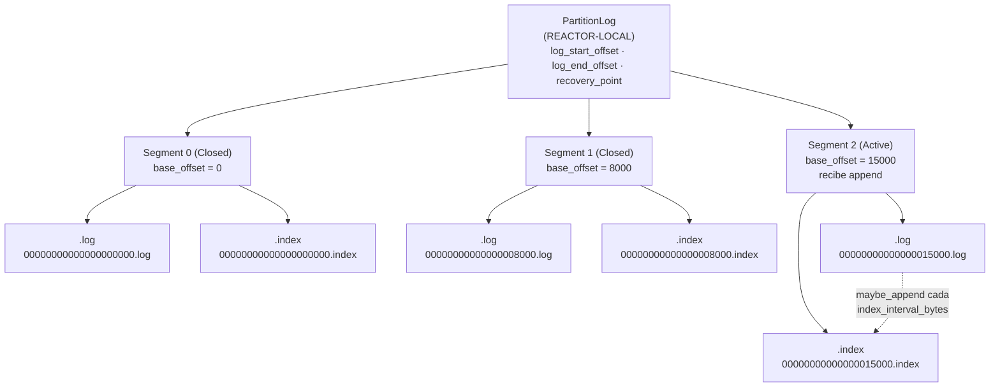
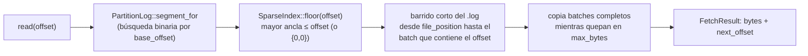

# Diagrama 8: Layout del log de una partición

El log de una partición es una secuencia *append-only* de **segmentos** sellados más un **segmento activo**; cada segmento es un par de ficheros `.log` (los `RecordBatch` en orden de *offset*) y `.index` (índice disperso *offset*→posición). Este diagrama detalla esa estructura física, el byte-layout de la cabecera de batch y la mecánica de *seek*.

> Fuentes: `src/storage/partition_log.hpp`, `src/storage/segment.hpp`, `src/storage/index.hpp`, `src/common/record.{hpp,cpp}`. Contrato de bytes: [`../protocol.md`](../protocol.md) (§ «Registros y batches»). Diseño: anteproyecto §5.4, §5.8, §7.1, §7.11.

## Composición: `PartitionLog` → `Segment` → (`.log` / `.index`)

Un `PartitionLog` ordena sus `Segment` por *offset* base; el último es el **activo** (recibe `append`). Al superar el activo `segment_bytes` (por defecto 64 MiB en `LogConfig`, configurable como `segment.bytes`), el siguiente `append` **rota**: sella el activo (`seal`: persiste el `.index` y `fsync`) y abre uno nuevo en `log_end_offset()`. Afinidad de todos estos tipos: **REACTOR-LOCAL** (no *thread-safe*).



- **Nombrado de ficheros:** cada segmento se nombra con su *offset* base a **20 dígitos** con relleno de ceros, de modo que el orden lexicográfico coincide con el orden de *offset* (`Segment`: `00000000000000000000.log` / `.index`).
- **Estados del segmento** (`Segment::State`, anteproyecto §5.9): `Active` (admite `append`; es el último del log) → `Closed` (sellado, índice persistido, solo lectura). La retención (Diagrama 9) borra después segmentos `Closed` enteros.
- **Offsets del log** (`PartitionLog`): `log_start_offset()` (base del primer segmento), `log_end_offset()` (siguiente *offset* a asignar) y `recovery_point()` (hasta dónde está sincronizado a disco estable, garantía de durabilidad).

## Byte-layout del `.log`: secuencia de `RecordBatch`

El `.log` es una concatenación de `RecordBatch` (estilo Kafka v2) escritos en orden por su *offset* base. El batch viaja **intacto** por el log y la replicación: es la unidad de escritura y de entrada de Raft (ADR-0014). El payload de records se trata como **bytes opacos** a este nivel.

```
.log  =  [ RecordBatch ][ RecordBatch ][ RecordBatch ]...  (append-only)

RecordBatch (little-endian; cabecera fija = kHeaderSize = 36 bytes):

 offset  campo            tipo   notas
 ------  ---------------  -----  --------------------------------------------------
   0     base_offset      i64    offset del primer record (NO cubierto por el CRC)
   8     length           i32    bytes tras este campo (NO cubierto por el CRC)
  12     crc              u32    CRC32C; cubre desde attrs (16) hasta el final
  16     attrs            u16    códec de compresión (2 bits bajos) + flags  ┐
  18     producer_id      i64    productor idempotente (-1 = ninguno)         │ región
  26     producer_epoch   i16    época del productor                          │ cubierta
  28     base_sequence    i32    secuencia base (idempotencia)                │ por el CRC
  32     record_count     i32    nº de records del payload                    │
  36     records[]        bytes  blob opaco (puede ir comprimido, F5)         ┘
```

Notas fieles al código (`src/common/record.cpp`):

- **`length`** cuenta los bytes **tras** el propio campo `length`: `encoded_size = 12 (offset+length) + length`, o equivalentemente `kHeaderSize + records.size()`.
- **El CRC32C cubre `[attrs .. fin]`**, es decir, la cola de cabecera (desde el byte 16) más el blob de records. `base_offset`, `length` y `crc` quedan **fuera** del CRC: por eso el log puede **reasignar `base_offset`** al anexar (el líder asigna el *offset* autoritativo) sin invalidar la integridad.
- **Compresión (F5):** los **2 bits bajos** de `attrs` indican el códec (`0`=None, `1`=LZ4, `2`=Zstd). El broker guarda y replica el blob comprimido como opaco; solo el cliente lo descomprime. Ver [`../protocol.md`](../protocol.md).
- **Decodificación defensiva** (`decode`/`peek`): se acota `length` (no negativo, `total ≤ bytes disponibles`) antes de derivar el tamaño; un batch *torn* (escrito a medias por un *crash*) se detecta así y por el CRC. Invariante de serialización: `decode(encode(x)) == x`.

### Byte-layout de cada `record` dentro del blob

Cada record del blob va con prefijo de longitud (estilo Kafka v2, `src/common/record_codec.hpp`):

```
record = length:varint(zigzag) | attributes:i8 | timestampDelta:varint |
         offsetDelta:varint | keyLen:varint(-1=nulo) | key |
         valueLen:varint(-1=nulo) | value | headerCount:varint | headers[]
```

- El **offset absoluto** de un record se reconstruye al decodificar como `base_offset + offsetDelta`.
- Un record con `value` nulo es un **tombstone** (marca de borrado por clave para la compactación; ver Diagrama 9).
- Topes anti-DoS al decodificar entrada no confiable: `kMaxRecordsPerBatch` (1 000 000), `kMaxHeadersPerRecord` (10 000), `kMaxRecordBytes` (64 MiB descomprimido).

## Byte-layout del `.index`: índice disperso (`SparseIndex`)

El `.index` **no** indexa cada batch, sino uno aproximadamente cada `index_interval_bytes` (por defecto 4096 en `LogConfig`): un compromiso espacio/tiempo que mantiene el índice pequeño y permite *seek* con búsqueda binaria más un barrido corto del `.log`.

```
.index  =  [ IndexEntry ][ IndexEntry ]...   (ordenadas estrictamente por offset)

IndexEntry (little-endian; kEntrySize = 8 bytes):

 offset  campo            tipo   notas
 ------  ---------------  -----  -----------------------------------------------
   0     relative_offset  u32    offset absoluto − base_offset del segmento
   4     file_position    u32    byte donde empieza ese batch en el .log
```

- **`relative_offset`** = *offset* absoluto − base del segmento; cabe en `u32` porque el segmento está acotado por `segment_bytes`. Ambos campos crecen de forma **estrictamente monótona** a lo largo del índice (invariante).
- `SparseIndex` posee el fichero `.index` (RAII) y mantiene las entradas en memoria como espejo del disco; `maybe_append(offset, file_position, batch_len)` siembra una entrada solo cuando el intervalo lo exige; `flush()` persiste lo pendiente y hace `fsync` (al sellar); `reset()` lo vacía para reconstruirlo durante `recover`.

## Mecánica de *seek* (fetch desde un offset; anteproyecto §7.11 #3)



- `PartitionLog::read` localiza el segmento por *offset*, delega en `Segment::read` y, si no se llena `max_bytes` y quedan datos, **continúa en el segmento siguiente** (lectura cruzando segmentos) hasta `log_end_offset()`. `OutOfRange` si el *offset* es anterior a `log_start_offset()`.
- `Segment::read` no revalida el CRC (eso es de `recover`); ante un batch *torn* al final, se detiene.

## Recuperación al arrancar (`Segment::recover`; anteproyecto §7.11 #2)

Al abrir el log, `PartitionLog::open` descubre los `.log` del directorio, abre todos los segmentos y **recupera el activo**: recorre los batches desde el inicio validando `length` y CRC32C, se detiene en el primer batch incompleto o corrupto (la cola *torn* de un *crash*), **trunca el `.log`** justo tras el último batch válido y **re-siembra el `.index`**. Así se fija `log_end_offset()` y `recovery_point`.

## Durabilidad (`FsyncPolicy`)

`PartitionLog::maybe_sync` aplica la política de `fsync` configurada (`LogConfig::fsync_policy`) tras cada `append`:

| Política   | Cuándo hace `fsync`                                   | Compromiso              |
| ---------- | ---------------------------------------------------- | ----------------------- |
| `None`     | Nunca explícitamente (durabilidad solo por el SO)    | Máximo rendimiento      |
| `Interval` | Al acumular `fsync_interval_bytes` (def. 1 MiB)      | Equilibrado (por defecto) |
| `Commit`   | En cada `append`                                     | Durabilidad por escritura, el más lento |

Tras un fallo, solo lo sincronizado hasta `recovery_point` está garantizado. Cada `seal` (rotación) sincroniza el segmento y avanza `recovery_point` a `log_end_offset`.
