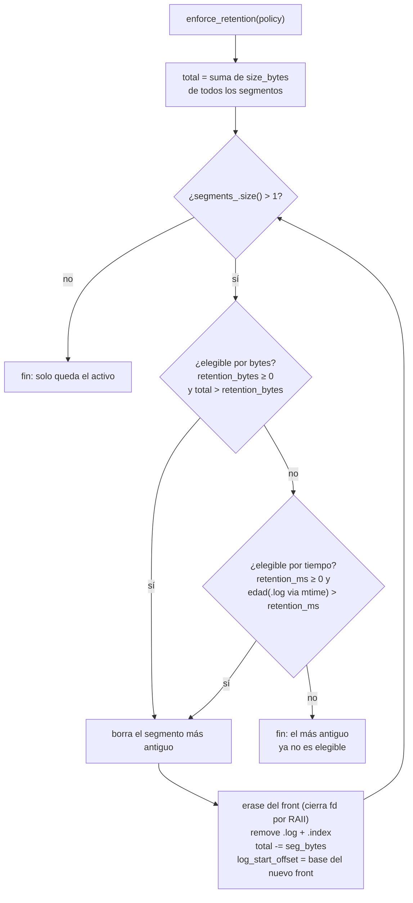
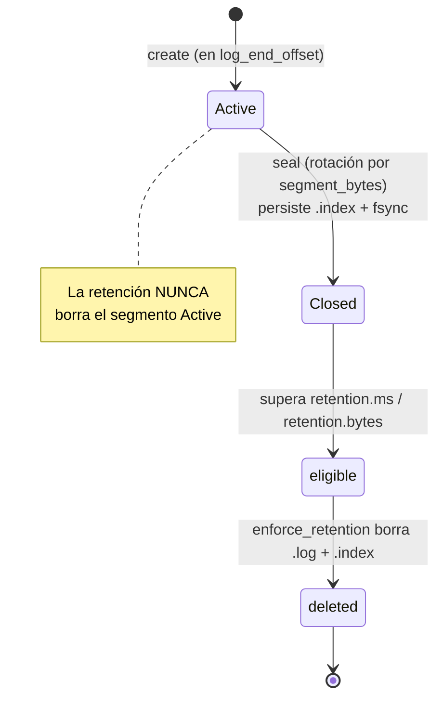
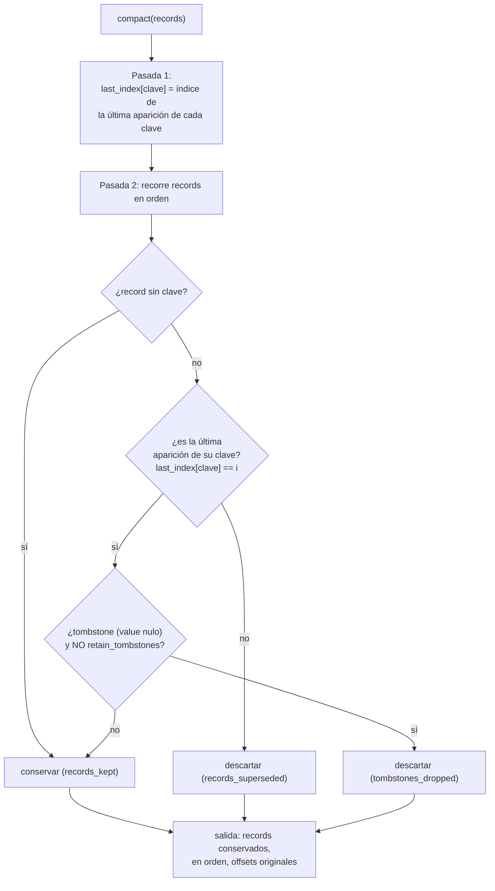

# Diagrama 9: Retención y compactación del log

El log de una partición se acota por dos mecanismos independientes: la **retención** borra segmentos sellados enteros cuando superan `retention.ms`/`retention.bytes`, y la **compactación por clave** (`LogCompactor`) conserva solo el último record por clave. Este diagrama detalla ambos flujos tal como los implementa `nexus-storage`.

> Fuentes: `src/storage/partition_log.{hpp,cpp}` (`enforce_retention`), `src/storage/retention.hpp` (`RetentionPolicy`), `src/storage/log_compactor.{hpp,cpp}` (`LogCompactor`). Diseño: anteproyecto §5.9 (ciclo de vida del segmento), §6.5, §7.10. Mecanismo vs política (§6.1): el storage ofrece el mecanismo; la política la fija el llamante.

## 1. Retención por segmentos sellados enteros (`PartitionLog::enforce_retention`)

La retención **nunca borra a media trama ni el segmento activo**: la reclamación física es siempre por **segmentos `Closed` completos**. Recorre del más antiguo al más nuevo mientras quede más de un segmento (`segments_.size() > 1`) y el más antiguo sea **elegible**; en cuanto el más antiguo deja de serlo, el resto tampoco lo es y se detiene.

Criterios de elegibilidad (`RetentionPolicy`, ambos opcionales con `< 0` = sin límite):

- **Por tamaño** (`retention_bytes`): el **total** de bytes del log supera `retention_bytes`.
- **Por tiempo** (`retention_ms`): la edad del segmento, tomada del *mtime* de su `.log`, supera `retention_ms`. (Los records aún no llevan *timestamp*; cuando lo lleven, podrá usarse el *timestamp* máximo del segmento.)

Efectos de borrar un segmento (fieles a `enforce_retention`): se quita del frente del vector (lo que **cierra sus descriptores por RAII**), se eliminan los ficheros `.log` e `.index`, se descuenta su tamaño del total y se **avanza `log_start_offset()`** hasta la base del nuevo primer segmento.

### Ciclo de vida del segmento (anteproyecto §5.9)

> `eligible` y `deleted` son fases lógicas del ciclo de vida descrito en el anteproyecto; en el código el estado persistente del `Segment` es solo `Active`/`Closed`, y la elegibilidad se evalúa dentro de `enforce_retention`.

## 2. Compactación por clave (`LogCompactor`)

Política **alternativa/complementaria** a la retención por tiempo/tamaño (§6.5): conserva, **por clave, solo el record más reciente** (la última aparición en orden de *offset*); las apariciones anteriores se descartan. Es REACTOR-LOCAL y **sin estado mutable**. Los *offsets* originales se **preservan** (pueden quedar huecos), igual que en Kafka.

Reglas (de `compact`):

- **Records sin clave** (`key == nullopt`): se conservan **siempre** (la compactación solo colapsa por clave).
- **Record con clave reemplazado** por otro posterior con la misma clave: se descarta (`records_superseded`).
- **Tombstone** (record con `value == nullopt`): supera a los anteriores de su clave y, salvo que se construya el `LogCompactor` con `retain_tombstones = true`, se **descarta también él** (`tombstones_dropped`), haciendo desaparecer la clave del log compactado.

`CompactionStats` reporta la pasada: `records_in`, `records_kept`, `records_superseded`, `tombstones_dropped`.

### Lectura del log completo (`compact_log`)

`compact_log(log)` lee **todos** los records del `PartitionLog` (de `log_start_offset()` a `log_end_offset()`) por trozos de hasta 4 MiB, decodificando cada `RecordBatch` (`peek` para el tamaño, `decode` con validación de CRC, `decode_records` para el blob, descomprimiéndolo si procede) y los compacta preservando los *offsets* absolutos. Devuelve error de E/S o `Corrupt` si el log está dañado; incluye defensas anti bucle infinito (sin progreso de `next_offset` o lectura vacía).

## Relación entre ambos mecanismos

- La **retención** es física y gruesa (segmentos enteros); reclama espacio por antigüedad/tamaño sin mirar el contenido.
- La **compactación** es lógica y por clave; produce un conjunto de records compactado (la materialización a nuevos segmentos es responsabilidad del llamante, no de `LogCompactor`).
- Existe además un recorte de **prefijo por snapshot de Raft** (`PartitionLog::truncate_prefix_to`, ADR-0024): pieza simétrica de la retención que borra segmentos sellados enteros por debajo de un *offset* preciso (reclamación física por segmentos; la exactitud en el índice la lleva el `RaftLog`). Distinto de la política de tamaño/tiempo de este diagrama.

Ver también el [Diagrama 8](08-layout-log.md) (layout del log y segmentos) y [`../protocol.md`](../protocol.md) (formato del `RecordBatch` y *tombstones*).
