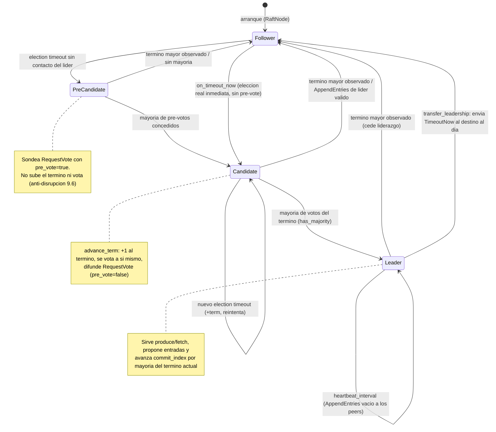

# Diagrama 10: Estados y transiciones de una réplica Raft

Ciclo de vida del rol de un `RaftNode` por partición (`Follower` ⇄ `PreCandidate` ⇄ `Candidate` ⇄ `Leader`), con la fase de *pre-vote* (§9.6) y la transferencia ordenada de liderazgo (§3.10) tal como las implementa `src/consensus/raft_node.hpp` (ADR-0003/0015).

> Regla transversal (cualquier rol): observar un `term` mayor en cualquier RPC degrada el nodo a `Follower` y adopta ese término (`become_follower`). Un `learner` (§4.2.1) nunca se postula: replica el log sin votar ni contar para el quórum.
