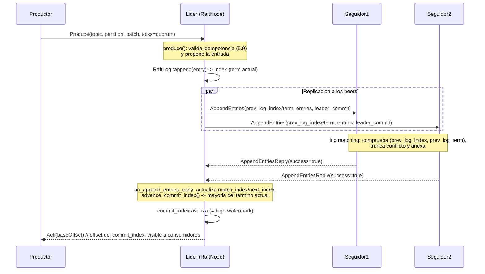

# Diagrama 11: Replicación y confirmación a quórum (`acks=quorum`)

Camino de escritura con Raft por partición: el productor envía al líder, este añade la entrada al log, la replica con `AppendEntries`, y cuando una mayoría confirma avanza `commit_index` (= *high-watermark*) y responde (§7.8, ADR-0003/0014). Una entrada de Raft es un `RecordBatch`; `ReplicatedPartition::produce` propone y la escritura es durable cuando `high_watermark()` la supera.

> El `commit_index` **es** la *high-watermark*: el offset de partición del `last_offset` de la entrada en `commit_index` (ADR-0014). `acks=0` responde sin esperar; `acks=1`, tras el *append* local del líder; `acks=quorum` (por defecto), tras el *commit* de Raft. Solo se cuenta en el quórum a los miembros votantes (los `learner` replican pero no cuentan).
