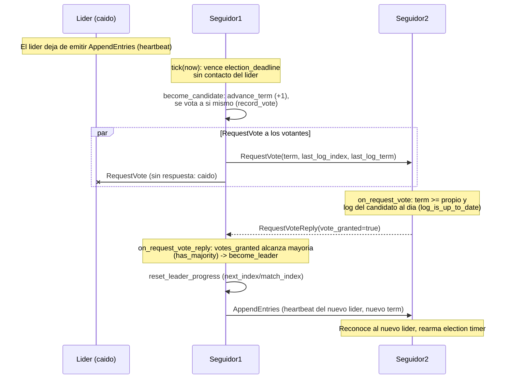

# Diagrama 12: Failover y elección de líder

Cuando el líder cae, un seguidor agota su *election timeout* sin recibir *heartbeats*, se postula incrementando el término, difunde `RequestVote` y, al reunir mayoría, se convierte en líder y reanuda la replicación (§5.2, ADR-0003/0015). El diagrama omite la fase de *pre-vote* previa (§9.6) para centrarse en el *failover*.

> El estado persistente (término y voto) se guarda con `fsync` **antes** de responder al RPC (regla §5 de Raft): lo gobierna `persistent_state_dirty()` y lo ejecuta el `RaftCarrier` antes de transportar. Ningún dato confirmado con `acks=quorum` se pierde mientras sobreviva la mayoría del grupo: el nuevo líder tiene, por la restricción de elección, todas las entradas *committed*.
