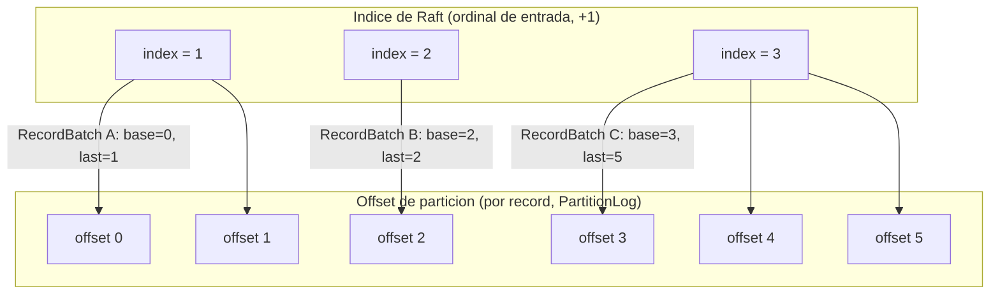

# Diagrama 13: Espacios de coordenadas (índice de entrada Raft vs offset por record)

NexusMQ mantiene **dos espacios de coordenadas distintos** (ADR-0014): el **índice de Raft** es el ordinal de cada entrada (1-based, +1 por entrada), mientras que el **offset de partición** es por *record* (un `RecordBatch` de N records ocupa N offsets). Una entrada de Raft equivale a un `RecordBatch`, así que cada índice mapea a un **rango** de offsets `[base_offset, last_offset]`. El `RaftLog` posee ese mapeo y lo persiste en el sidecar `raft-meta`.

Correspondencia que mantiene el sidecar `raft-meta` (`term:i64 | base_offset:i64 | last_offset:i64 | type:u8`, 25 B/entrada):

| Índice Raft | term | `base_offset` | `last_offset` | Records del batch |
|---|---|---|---|---|
| 1 | t1 | 0 | 1 | 2 |
| 2 | t1 | 2 | 2 | 1 |
| 3 | t2 | 3 | 5 | 3 |

> El algoritmo de Raft opera sobre índices contiguos (`prev_log_index`, `commit_index`, `truncate_from`); la capa de partición traduce al espacio de offsets. La **high-watermark** visible a consumidores = `last_offset` de la entrada en `commit_index` (`offsets_at(commit_index)`). La resolución de conflictos `truncate_from(index)` recorta el `PartitionLog` por la **frontera de batch** `base_offset(index)`, dejando los `RecordBatch` intactos en disco.
