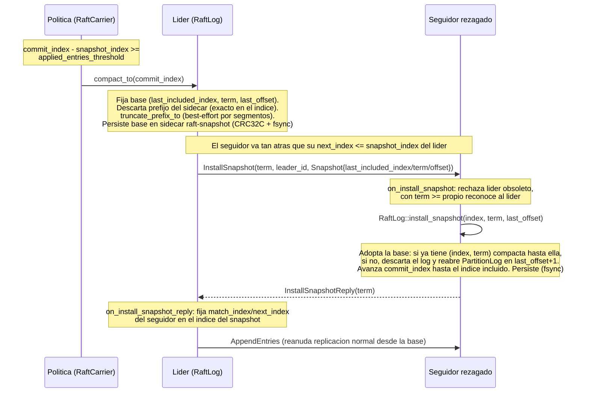

# Diagrama 14: Compactación por snapshot e `InstallSnapshot`

El log replicado es el WAL y crece sin techo; la compactación por *snapshot* (ADR-0024) fija una **base** `(last_included_index, last_included_term, last_included_offset)`, descarta el prefijo aplicado y permite poner al día a un seguidor demasiado rezagado con `InstallSnapshot` en vez de re-replicar desde el índice 1 (§7 del paper). En NexusMQ el "estado" del snapshot **es la propia base** (índice/término/offset): los datos viven en el `PartitionLog`.

> Coherente con ADR-0015 (FSM sin E/S): instalar un snapshot es una transición síncrona que reposiciona la base del log; la E/S durable la hace el `RaftLog`/portador, no el `RaftNode`. La compactación es *best-effort*: un fallo de E/S deja el log intacto y se reintenta en el próximo `tick`.
