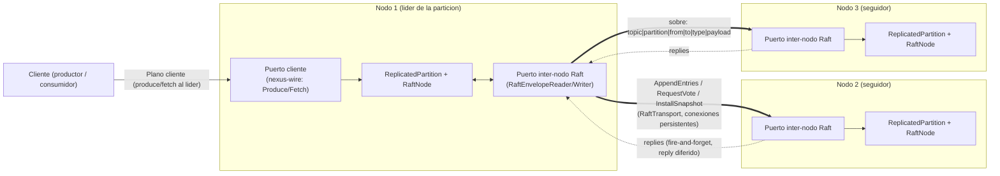

# Diagrama 15: Planos de red (cliente vs inter-nodo Raft)

NexusMQ separa el **plano de cliente** (produce/fetch contra el líder, sobre el framing de `nexus-wire`) del **plano inter-nodo de Raft** (`AppendEntries`/`RequestVote`/`InstallSnapshot`), que viaja por su **propio puerto y conexiones persistentes** (ADR-0025). El plano inter-nodo usa el sobre `RaftEnvelope` (`topic | partition | from | to | type:u8 | payload`) con prefijo de longitud sobre TCP, sin `FrameHeader`/`ApiKey`, para mantener ambos protocolos ortogonales.

> El `RaftTransport` (sumidero `RaftMessageSink`) mantiene una conexión TCP persistente por peer, resolviendo `NodeId` -> `PeerAddress` (host + **puerto inter-nodo**) vía `PeerDirectory`. Es *best-effort*: Raft reenvía en el próximo `tick`. A diferencia del `call_on` cross-core (local y síncrono), un RPC a un nodo remoto **no vuelve** al completarse: su respuesta llega después como **otro** sobre (notificación asíncrona, ADR-0025). El `RaftCarrier` vive en el reactor dueño de la partición (`core = partition % cores`), respetando *shared-nothing*.
