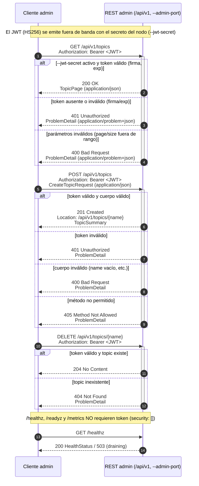

# Diagrama 18: Flujo REST admin con JWT

El plano de administración de NexusMQ es una API REST bajo `/api/v1` servida en el **puerto de
operación** (`nexusd --admin-port <N>`, sin valor por defecto), separada del plano de datos binario.
Las rutas `/api/v1/*` se autentican con **Bearer JWT** (HS256, firmado con el secreto del nodo)
**solo si** el nodo arrancó con `--jwt-secret`; en ese caso devuelven `401` sin un token válido. Los
errores siguen **RFC 7807** (`application/problem+json`). Los *endpoints* de salud/métricas
(`/healthz`, `/readyz`, `/metrics`) van **sin autenticar**. Contrato:
[`../openapi.yaml`](../openapi.yaml).

## Notas del contrato

- **Validación del token en el borde:** la API comprueba la **firma** (HS256 con el secreto del nodo)
  y la **expiración** antes de servir cualquier ruta `/api/v1/*`. Si `--jwt-secret` no está activo, no
  se exige token.
- **Política de errores central (RFC 7807):** toda respuesta de error usa `ProblemDetail`
  (`application/problem+json`) con al menos `title` y `status`. El estándar contempla además `403`
  (no autorizado) para autorización por recurso, aunque el contrato actual detalla `400`/`401`/`404`/`405`.
- **Códigos por operación** (según `openapi.yaml`): `GET /api/v1/topics` → `200`/`400`/`401`;
  `POST /api/v1/topics` → `201`/`400`/`401`/`405`; `GET /api/v1/topics/{name}` → `200`/`401`/`404`;
  `PATCH /api/v1/topics/{name}` → `200`/`400`/`401`/`404`; `DELETE /api/v1/topics/{name}` →
  `204`/`401`/`404`/`405`; `GET /api/v1/groups` → `200`/`400`/`401`/`405`; `GET /api/v1/groups/{id}`
  → `200`/`401`/`404`; `GET /api/v1/cluster` → `200`/`401`.
- **Paginación:** las colecciones aceptan `page` (≥1, def. 1) y `size` (1–100, def. 20).
