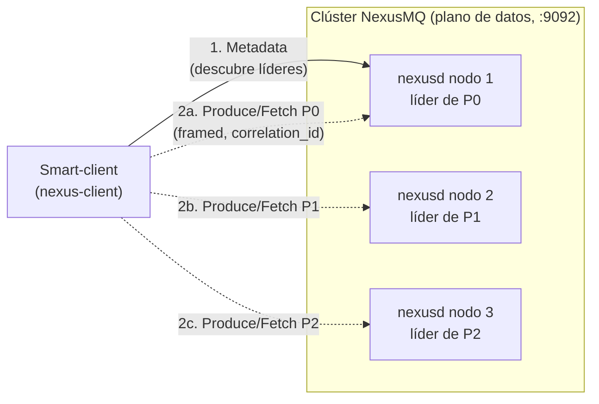
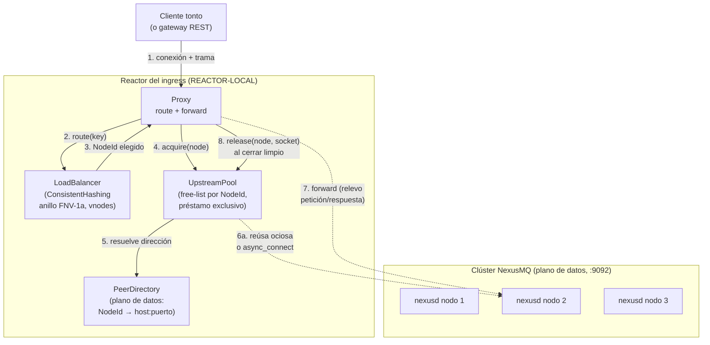

# Diagrama 19: Ingress en dos modos — nativo directo vs proxy

El *ingress* de NexusMQ soporta **dos modos** con una jerarquía explícita (ADR-0006): el **nativo
directo** (primario) y el **proxy** (secundario, *opt-in*, cableado en el plano de datos por
ADR-0027). El nativo prioriza el rendimiento; el proxy, la conveniencia para clientes "tontos" y
HTTP, asumiendo a sabiendas un salto extra y la ruptura del *zero-copy*. Fuentes:
[`../adr/adr-0006-ingress-dos-modos.md`](../adr/adr-0006-ingress-dos-modos.md),
[`../adr/adr-0027-modo-proxy-upstream-pool.md`](../adr/adr-0027-modo-proxy-upstream-pool.md),
`src/ingress/proxy.hpp`, `src/ingress/load_balancer.hpp`, `src/ingress/upstream_pool.hpp`.

## Modo nativo directo (primario)

El *smart-client* conoce la topología: pide *metadata*, descubre el **líder** de cada partición y le
habla **directamente** por el plano de datos. Sin proxy, sin salto extra, sin romper el *zero-copy*.

- El cliente **gestiona la *metadata*** y el descubrimiento de líder (coste asumido en el cliente).
- Camino caliente sin intermediarios: máxima latencia/throughput por defecto.

## Modo proxy (secundario, opt-in)

El cliente "tonto" no conoce la topología: se conecta al *ingress*, que **enruta** su tramo por
*consistent-hashing* (`LoadBalancer`, anillo FNV-1a con *vnodes*) y **releva** sus tramas
(petición/respuesta a nivel de trama, `Proxy::forward`) a una conexión obtenida del `UpstreamPool`.
Cada reactor tiene su propio *pool* (REACTOR-LOCAL, sin locks, *shared-nothing*).

- **`route`**: `Proxy::route(key)` delega en `LoadBalancer::pick` con *consistent-hashing* (mínima
  perturbación al añadir/quitar nodos); devuelve `nullopt` si el anillo está vacío.
- **`acquire`/`release`**: el `UpstreamPool` entrega una conexión **en préstamo exclusivo** (reúsa
  una ociosa de la *free-list* del nodo o **diala** una nueva con `Socket::async_connect`, sin
  congelar el reactor) y la recupera al cerrar el cliente; la *free-list* está **acotada**
  (`max_idle_per_node`, def. 8) para no fugar descriptores.
- **Préstamo exclusivo**: garantiza que **no se intercalan** tramas de dos clientes en la misma
  conexión aguas arriba (corrección del relevo).
- **Dos `PeerDirectory` distintos**: el del plano de datos (este) es una **instancia separada** del
  de Raft (ADR-0025); mismo tipo, distinta instancia.

## Trade-offs (por qué dos modos, no uno)

| Aspecto | Nativo directo | Proxy |
| --- | --- | --- |
| Camino | cliente → líder | cliente → ingress → nodo |
| Saltos extra | 0 | 1 (asumido) |
| *Zero-copy* | sí | se rompe (copia en el relevo) |
| Cliente | *smart* (gestiona metadata) | *tonto* / HTTP |
| Activación | por defecto | *opt-in* |
