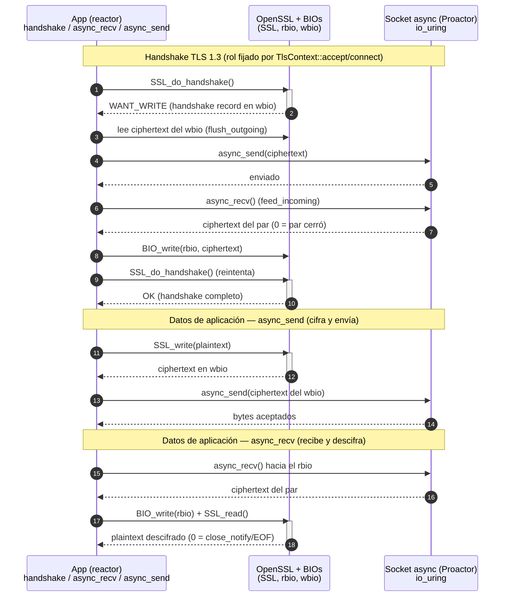

# Diagrama 20: Puente TLS — OpenSSL síncrono sobre el proactor asíncrono

NexusMQ termina **TLS 1.3** (y, intra-clúster, **mTLS**) en el *ingress* (§7.9). OpenSSL es la
librería elegida, pero su E/S es **síncrona/bloqueante**, mientras que el broker es
*thread-per-core* **asíncrono** sobre un `Proactor` (io_uring). La solución (ADR-0019) es un **puente
de BIOs de memoria**: OpenSSL nunca toca el descriptor; cifra/descifra contra dos `BIO` en memoria
(`rbio`/`wbio`) y el transporte se hace de forma asíncrona vaciando/alimentando esos BIOs por el
`Proactor`. Así la criptografía corre en línea, pero el socket es no bloqueante. Fuentes:
[`../adr/adr-0019-tls-opcional-openssl-bios.md`](../adr/adr-0019-tls-opcional-openssl-bios.md),
`src/ingress/tls.hpp` (`TlsContext`/`TlsConnection`).

## Cómo funciona el bucle (qué hace cada pieza)

- **`TlsContext`** (THREAD-SAFE, RAII sobre `SSL_CTX`): fábricas `server`/`client` cargan el material
  PEM (cadena de certificado, clave privada) y, si se da una CA, configuran **mTLS**
  (`SSL_VERIFY_PEER | FAIL_IF_NO_PEER_CERT`). `accept`/`connect` abren una `TlsConnection` fijando el
  rol del *handshake*.
- **`TlsConnection`** (REACTOR-LOCAL, *solo movible*): posee el `SSL*` y el `Socket`. Las primitivas
  OpenSSL (`SSL_do_handshake`/`SSL_read`/`SSL_write`) operan **solo contra los BIOs de memoria**:
  - ante `WANT_WRITE`, `flush_outgoing` **vacía** el `wbio` al socket (`async_send`);
  - ante `WANT_READ`, `feed_incoming` **alimenta** el `rbio` con lo leído del socket (`async_recv`);
    un retorno de `0` byte significa que el par cerró (EOF / `close_notify`).
- **`peer_principal()`**: extrae el **CN** del certificado del par para *authz* (mTLS).

## Acoplamiento opcional (coste cero, ADR-0008)

El build usa `find_package(OpenSSL)`. Si está presente, compila `ingress/tls.{hpp,cpp}` y define
`NEXUS_HAVE_OPENSSL` (toda la cabecera vive bajo `#ifdef NEXUS_HAVE_OPENSSL`); si no, el plano TLS se
**omite por completo** y el broker arranca **en claro**. El CI instala `libssl-dev` para ejercer el
*path* TLS (compilación, tests, sanitizers y clang-tidy).

> Coste asumido: el puente de BIOs añade una copia intermedia *ciphertext ↔ socket*; es aceptable
> porque el throughput TLS lo domina la cifra, no esa copia.
