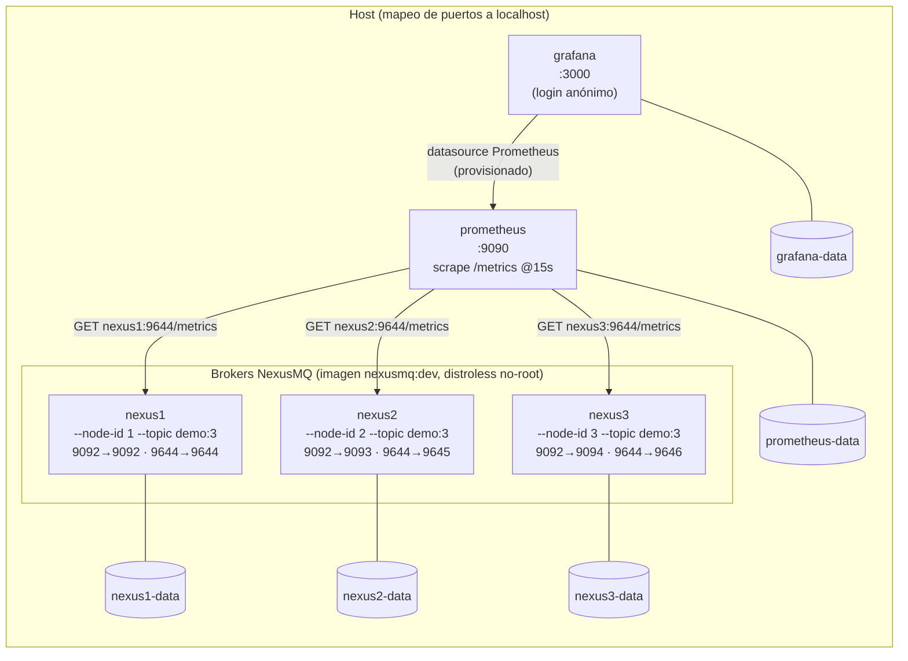

# Diagrama 21: Despliegue local con Docker Compose

El `docker compose` de `deploy/` levanta **3 nodos `nexusd`** + **Prometheus** + **Grafana** para
validar el empaquetado, la observabilidad y los *probes* de salud sobre varias instancias. En Fase 3
los tres nodos son **brokers independientes** (el runtime de clúster multi-nodo —descubrimiento de
líder, replicación entre nodos— llega en fases posteriores). Cada `nexusd` expone dos puertos: el
**plano de datos** (`9092`, protocolo binario *framed* con `correlation_id`) y el **puerto de
operación** (`9644`: `/healthz`, `/readyz`, `/metrics`, `/api/v1/...`). Fuente:
[`../../deploy/docker-compose.yml`](../../deploy/docker-compose.yml),
[`../../deploy/prometheus.yml`](../../deploy/prometheus.yml).

## Detalles del despliegue (fieles al compose)

- **Imagen `nexusmq:dev`**: build multi-stage (Ubuntu para compilar → **distroless `cc`**, no-root)
  desde la raíz del repo (`deploy/Dockerfile`). El `HEALTHCHECK` reutiliza `nexus-cli diagnostics`
  (distroless no trae *shell* ni `curl`): el contenedor pasa a *healthy* solo cuando `/healthz` y
  `/readyz` responden OK. `restart: unless-stopped` en todos los servicios.
- **Mapeo de puertos en `localhost`**: nexus1 `9092/9644`, nexus2 `9093/9645`, nexus3 `9094/9646`
  (el puerto interno es `9092/9644` en los tres; cambia el lado del host).
- **Persistencia**: un volumen de datos por nodo (`nexusN-data` → `/var/lib/nexusmq`), más
  `prometheus-data` y `grafana-data`.
- **Prometheus** (`:9090`): raspa `/metrics` (`metrics_path: /metrics`) de los tres por su **nombre
  de servicio** en compose (`nexus1:9644`, `nexus2:9644`, `nexus3:9644`), `scrape_interval: 15s`,
  etiqueta `cluster: local`; `depends_on` de los tres nodos.
- **Grafana** (`:3000`): login anónimo (rol `Admin`), *datasource* Prometheus **provisionado** desde
  `grafana/datasources.yml`; `depends_on` de Prometheus.

> Requisito del host: el kernel debe soportar **io_uring** (el broker usa el backend io_uring
> directo, ADR-0012).

Ver el flujo de scrape end-to-end en
[`23-pipeline-observabilidad.md`](./23-pipeline-observabilidad.md) y el despliegue a escala en
[`22-despliegue-kubernetes.md`](./22-despliegue-kubernetes.md).
