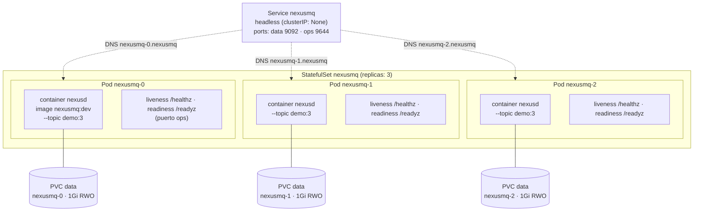

# Diagrama 22: Despliegue en Kubernetes — StatefulSet + Service headless

El broker tiene **estado persistente** (logs de partición), de ahí el **`StatefulSet`** (3 réplicas)
con `volumeClaimTemplates` (un **PVC por réplica**) y un **`Service` headless** (`clusterIP: None`)
que da DNS estable a cada réplica (`nexusmq-0.nexusmq`, `nexusmq-1.nexusmq`, …). Los *probes* van
sobre el **puerto de operación** (`ops`, 9644): **liveness** `/healthz`, **readiness** `/readyz`.
Fuentes: [`../../deploy/k8s/statefulset.yaml`](../../deploy/k8s/statefulset.yaml),
[`../../deploy/k8s/service.yaml`](../../deploy/k8s/service.yaml).

## Detalles del manifiesto (fieles a `deploy/k8s/`)

- **`StatefulSet`** (`replicas: 3`, `serviceName: nexusmq`): identidad y almacenamiento estables por
  réplica; `volumeClaimTemplates` crea un **PVC `data` de 1Gi (`ReadWriteOnce`)** por pod, montado en
  `/var/lib/nexusmq`.
- **`Service` headless** (`clusterIP: None`): no balancea por VIP; expone DNS por pod y agrupa los
  puertos `data` (9092) y `ops` (9644). El líder de partición se descubre por *metadata* (no por el
  Service), coherente con el modo nativo directo (ver
  [`19-modo-nativo-vs-proxy.md`](./19-modo-nativo-vs-proxy.md)).
- **Probes sobre el puerto `ops`**:
  - **liveness** `httpGet /healthz` (`initialDelay 5s`, `period 10s`, `failureThreshold 3`): ¿sigue
    vivo el proceso? Un fallo justifica reiniciar el pod.
  - **readiness** `httpGet /readyz` (`initialDelay 3s`, `period 5s`, `failureThreshold 3`): ¿puede
    recibir tráfico? Pasa solo con el arranque terminado y los *probes* (disco, Raft, *lag*) sanos;
    un `fail` retira el pod del balanceo sin matarlo.
- **Contenedor endurecido** (*hardening*): `runAsNonRoot` (uid/gid `65532`, `fsGroup 65532`),
  `readOnlyRootFilesystem: true`, `allowPrivilegeEscalation: false`, `capabilities.drop: [ALL]`.
- **Recursos**: `requests` cpu `250m` / mem `128Mi`; `limits` cpu `1` / mem `512Mi`.

> La imagen `nexusmq:dev` debe estar disponible para el clúster (build + push a un registry, o
> `kind load docker-image nexusmq:dev`) y el nodo debe soportar **io_uring**. Aplicar con
> `kubectl apply -f deploy/k8s/` y seguir con `kubectl rollout status statefulset/nexusmq`.
