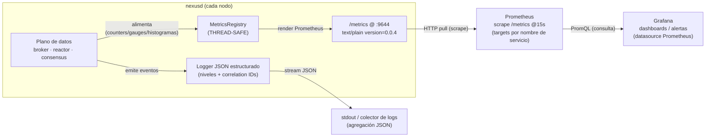

# Diagrama 23: Pipeline de observabilidad — métricas y logs

La observabilidad de NexusMQ es *self-hosted* (Prometheus + Grafana en Docker). El broker **alimenta**
una `MetricsRegistry` (THREAD-SAFE, en `nexus-telemetry`) desde las capas del plano de datos
(broker/reactor: tasa de produce/fetch, *lag*, `commit_index`/term de Raft, latencias) y la
**expone** en `/metrics` por el **puerto de operación** (`9644`), en **formato de exposición
Prometheus** (`text/plain; version=0.0.4`). Prometheus **raspa** ese endpoint periódicamente y
Grafana lo consulta como *datasource*. En paralelo, el proceso emite **logs JSON** estructurados (con
niveles y *correlation IDs*). Fuentes: [capítulo 12 (Observabilidad)](../tecnica/12-observabilidad.md), `src/telemetry/metrics.hpp`,
[`../../deploy/prometheus.yml`](../../deploy/prometheus.yml),
[`../../deploy/docker-compose.yml`](../../deploy/docker-compose.yml).

## Cómo fluye (fiel al código y al deploy)

- **Origen de las métricas** (§7.6, §9 ADR-0017): la `MetricsRegistry` vive en `nexus-telemetry`
  (no en `nexus-server`, un *exe* no enlazable, ni en `nexus-ingress`, que crearía el ciclo
  `broker → ingress`). Las capas inferiores **registran** métricas; el gateway REST y el servidor las
  **exponen** en `/metrics`.
- **Modelo *pull***: Prometheus **raspa** (no recibe *push*); en el compose, `scrape_interval: 15s`,
  `metrics_path: /metrics`, *targets* por nombre de servicio (`nexus1:9644`, `nexus2:9644`,
  `nexus3:9644`) con etiqueta `cluster: local` (ver
  [`21-despliegue-docker-compose.md`](./21-despliegue-docker-compose.md)).
- **Endpoint sin autenticar**: `/metrics`, `/healthz` y `/readyz` van **sin token** (`security: []`),
  a diferencia de `/api/v1/*` que usa Bearer JWT (ver
  [`18-flujo-rest-jwt.md`](./18-flujo-rest-jwt.md)).
- **Grafana**: consulta Prometheus por **PromQL** y pinta *dashboards* / dispara alertas; *datasource*
  provisionado desde `grafana/datasources.yml`.
- **Logs JSON**: estructurados, con niveles y *correlation IDs* para *tracing* de peticiones;
  emitidos a la salida estándar para que el orquestador/colector los agregue.

## Señales y SLOs (cómo se usan)

Las métricas materializan las **cuatro señales de oro** (latencia, tráfico, errores, saturación) y el
método **USE**, base de los SLOs en percentiles (**p95/p99/p999**, nunca solo la media). Las cifras
reales de rendimiento viven en [`../benchmarks.md`](../benchmarks.md) (no se inventan aquí).
