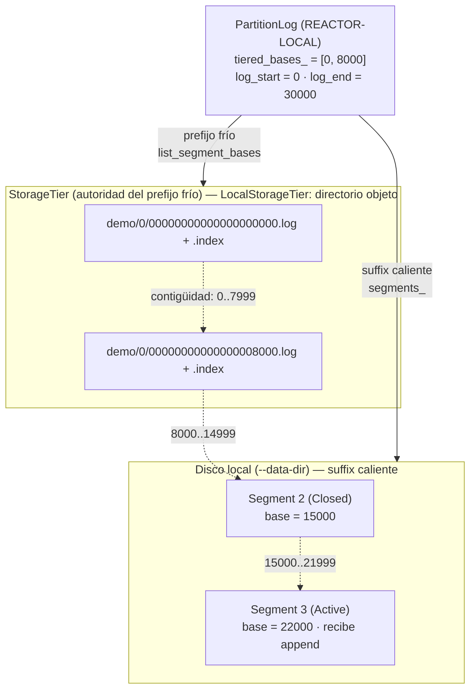
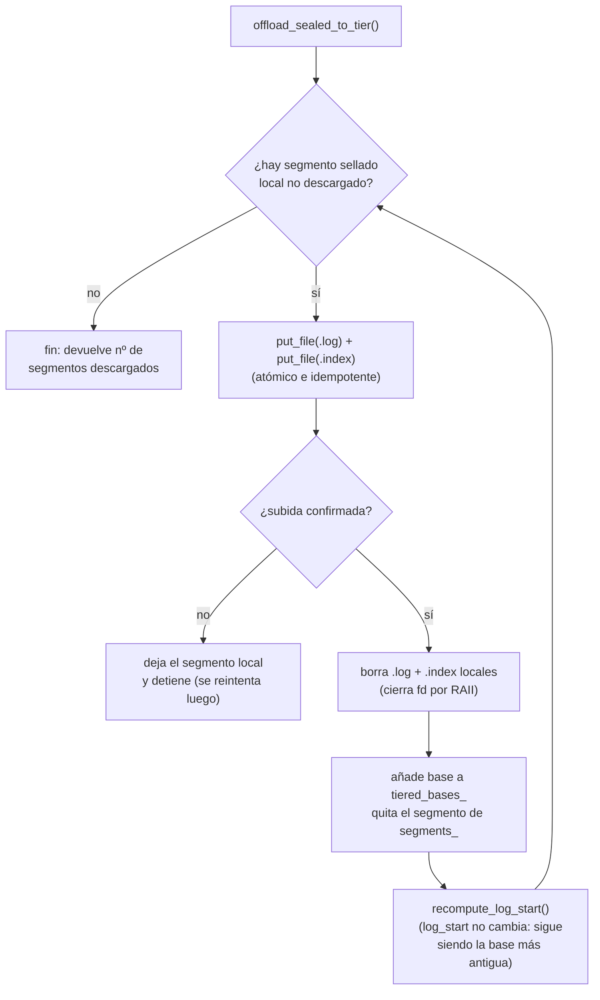
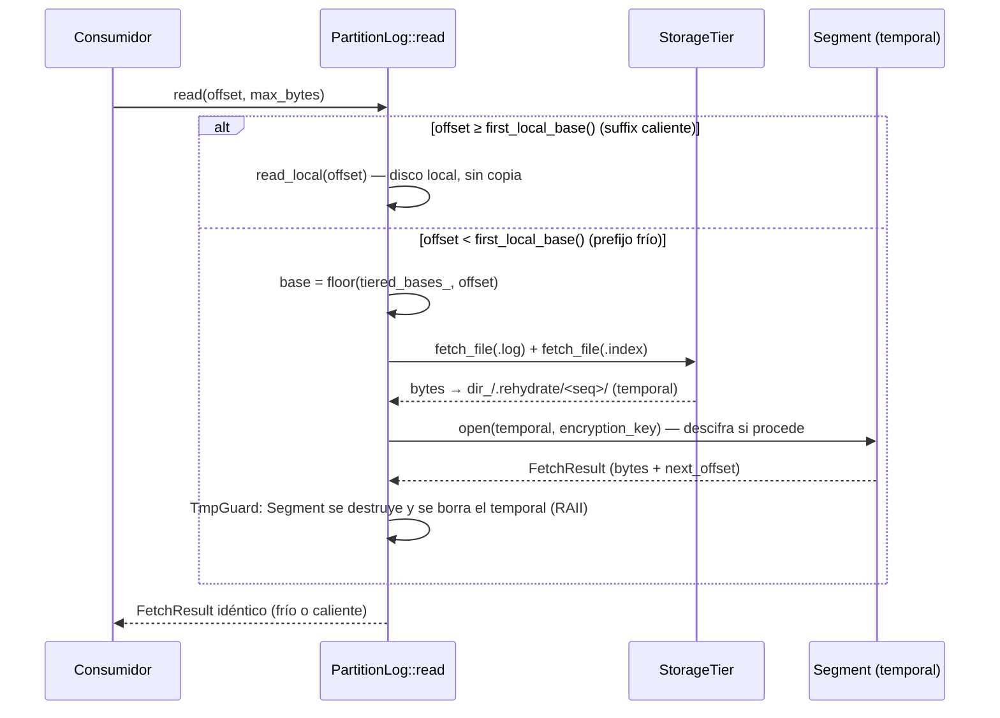
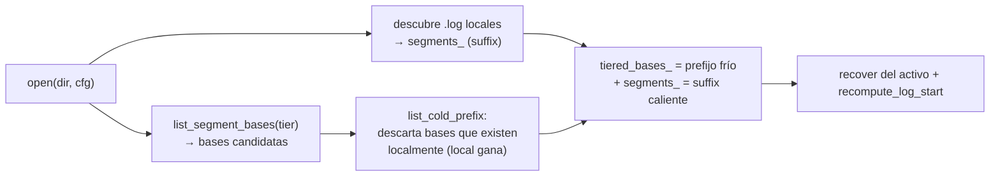

# Diagrama 24: Almacenamiento por niveles (tiered storage)

Con un tier configurado (`--tier-dir`), el log de una partición se parte en un **prefijo frío** —los segmentos sellados más antiguos, descargados a un almacén de objetos y reclamados del disco local— y un **suffix caliente** —los segmentos que siguen en disco, incluido el activo—. La descarga es opcional y con **degradación limpia**: sin tier, el prefijo frío está siempre vacío y el comportamiento es byte-idéntico al de hoy. Este diagrama detalla el puerto `StorageTier`, el ciclo de descarga/reclamación, la lectura transparente por rehidratación y las operaciones destructivas *tier-conscientes*.

> Fuentes: `src/storage/storage_tier.{hpp,cpp}` (`StorageTier`, `TierObjectKey`), `src/storage/local_storage_tier.{hpp,cpp}` (`LocalStorageTier`), `src/storage/partition_log.{hpp,cpp}` (`offload_sealed_to_tier`, `read`, `open`, `truncate_prefix_to`, `reset_to`). Diseño: [capítulo 9 (Almacenamiento), §9.7](../tecnica/09-almacenamiento.md), [ADR-0032](../adr/adr-0032-tiered-storage-puerto-y-tier-local.md). Layout base del log: [Diagrama 8](08-layout-log.md); retención/compactación: [Diagrama 9](09-retencion-compactacion.md).

## 1. Prefijo frío + suffix caliente sobre el puerto `StorageTier`

El `PartitionLog` depende de la **interfaz** `StorageTier` (inversión de dependencias), no de una nube concreta. El adaptador por defecto `LocalStorageTier` copia a un directorio objeto local; un adaptador S3 futuro implementaría el mismo contrato tras `find_package`. La clave de objeto `TierObjectKey` es determinista y jerárquica, de modo que listar el tier reconstruye el prefijo frío sin ningún manifiesto local.

- **La contigüidad del log (sin huecos)** implica que las **bases ordenadas** bastan para reconstruir el rango de cada segmento frío: el rango de una base es `[base, siguiente_base)`. `log_start_offset()` sigue siendo la base más antigua (esté fría o caliente); descargar **no cambia** el rango del log.
- **Clave de objeto** `TierObjectKey` → `"<topic>/<partition>/<base:020>.<ext>"` (p. ej. `demo/0/00000000000000008000.log`), con `SegmentFileKind ∈ {Log, Index}`. `encode()`/`decode()` son inversas (invariante de round-trip); el relleno a 20 dígitos preserva el orden lexicográfico = orden de offset.
- **Puerto orientado a fichero:** `put_file` / `fetch_file` / `contains` / `object_size` / `remove` / `list_segment_bases`, todos `expected<...>`. Un segmento **es** un fichero, así que descargar y rehidratar son copias (sin cargar segmentos en RAM); `LocalStorageTier` sube con **copia atómica** (temporal hermano + `rename`).

## 2. Ciclo descargar → reclamar (`offload_sealed_to_tier`)

Con un tier configurado, cada **rotación** de segmento (sellado del activo, [Diagrama 8](08-layout-log.md)) dispara la descarga de los sellados, *best-effort* (un fallo del tier no aborta la rotación: el segmento se queda local y se reintenta, idempotente). Se sube del **más antiguo al más nuevo** y **solo tras confirmar** la subida se borran los ficheros locales.

- **Nunca el segmento activo:** solo se descargan segmentos `Closed`. **Nunca se reclama sin confirmar:** el orden es *subir → verificar → borrar local → marcar frío*, así que un *crash* a mitad deja el segmento local intacto (reintento idempotente). `tiered_segment_count()` expone cuántos segmentos están fríos.
- **Interoperación con el cifrado (ADR-0031):** el `.log`/`.index` se suben **tal cual** (bytes opacos). Si el log va cifrado, el tier guarda **ciphertext**; la KEK nunca viaja al tier.

## 3. Lectura transparente por rehidratación (`PartitionLog::read`)

`read(offset)` sirve el suffix caliente directamente desde disco (camino de siempre) y, para un offset del prefijo frío, **rehidrata** el segmento a un temporal, lo sirve y limpia el temporal con **RAII**. El llamante no distingue frío de caliente: el offset, el rango y el `next_offset` son idénticos.

- **Orden de destrucción (RAII):** el `Segment` se cierra **antes** de que `TmpGuard` borre el directorio temporal, para que los ficheros estén cerrados al eliminarlos. `read` es lógicamente `const` (el temporal es un efecto de lado transitorio; no hay caché persistente — bajar el segmento entero por lectura fría es correcto pero no óptimo; una caché de rehidratación es trabajo futuro).
- `first_local_base()` es la base del primer segmento **local**; por debajo de ella, el offset vive en el prefijo frío.

## 4. Reapertura: el tier es la autoridad (`PartitionLog::open`)

Al reabrir, el prefijo frío se reconstruye **listando el tier** (`list_segment_bases(topic, partition)`), sin un manifiesto local que pudiera desincronizarse. Las bases que **también existen localmente** (descarga confirmada pero sin reclamar por un *crash*) se descartan del prefijo: el segmento local es autoritativo.

## 5. Operaciones destructivas *tier-conscientes*

Las operaciones que borran o reescriben el log se hacen conscientes del prefijo frío para no dejar objetos huérfanos ni reescribir historia comprometida:

| Operación | Comportamiento con prefijo frío |
| --------- | ------------------------------- |
| `truncate_prefix_to` (compactación / snapshot de Raft, ADR-0024) | Borra del tier (`remove`) los segmentos fríos que quedan por debajo del corte **antes** de descartarlos; simétrica de la retención. |
| `reset_to` (InstallSnapshot) | Borra del tier **todos** los segmentos fríos (`remove`) además de los locales; el log se reinicia limpio. |
| `truncate_to` (truncado de cola de Raft) | **Rechaza** (`Unsupported`) truncar dentro del prefijo frío: es historia ya comprometida, que Raft nunca reescribe (solo trunca colas no comprometidas, que están calientes). |
| `enforce_retention` (retención por tiempo/tamaño, [Diagrama 9](09-retencion-compactacion.md)) | No toca el *hot set* local mientras haya prefijo frío: los datos más antiguos ya están en el tier a bajo coste. |

> Recuperación ante **pérdida del disco local** (árbol local vacío con objetos en el tier) queda fuera de alcance: se prioriza el reinicio normal, que conserva al menos el segmento activo local (ADR-0032, *Consecuencias*).
