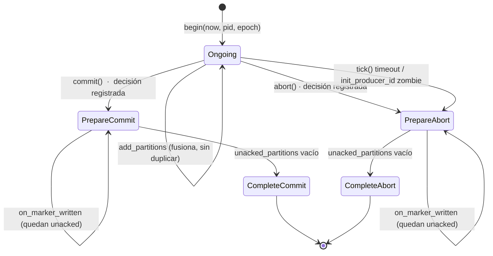
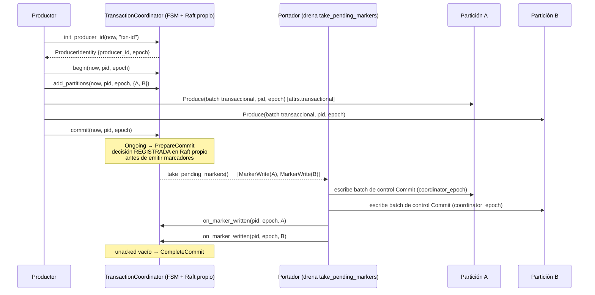
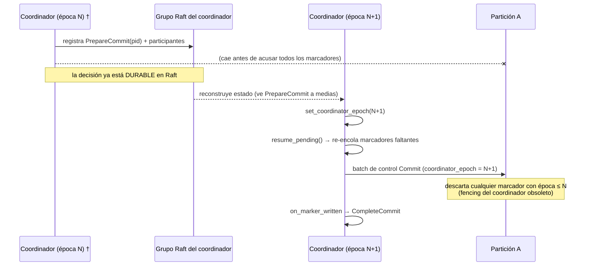
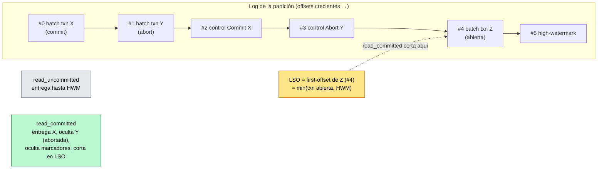

# Diagrama 25: Transacciones y 2PC logueado (exactly-once nativo)

El *exactly-once* multi-partición (ADR-0033 / ADR-0034) se apoya en un `TransactionCoordinator`: una **máquina de estados sin E/S** (mismo patrón que `RaftNode` y `GroupCoordinator`) que conduce un *two-phase commit* **logueado y recuperable, no bloqueante**. El coordinador **registra la decisión** (`PrepareCommit`/`PrepareAbort`) en su propio grupo Raft **antes** de escribir ningún marcador; el portador transporta las **órdenes de marcador** a cada partición participante y las acusa. Este diagrama detalla la FSM de una transacción, el flujo feliz del 2PC, la recuperación ante *failover* del coordinador y la visibilidad `read_committed` por LSO.

> Fuentes: `src/broker/transaction_coordinator.{hpp,cpp}` (`TransactionCoordinator`, `TransactionState`, `MarkerWrite`, `ProducerIdentity`), `src/broker/partition_txn_index.{hpp,cpp}` (`PartitionTxnIndex`, `IsolationLevel`, `AbortedTxn`), `src/common/control_record.{hpp,cpp}` (`EndTxnMarker`, `build_control_batch`). Diseño: [capítulo 10 §10.8](../tecnica/10-replicacion-y-consenso.md), [capítulo 9 §9.8](../tecnica/09-almacenamiento.md), [ADR-0033](../adr/adr-0033-exactly-once-nativo-transacciones.md), [ADR-0034](../adr/adr-0034-2pc-logueado-recuperable.md). Contrato de wire: [`../protocol.md`](../protocol.md#transacciones-y-marcadores-de-control-exactly-once-nativo).

## 1. FSM de una transacción en el coordinador

Una transacción vive el ciclo `Ongoing` → `Prepare*` (decisión registrada) → `Complete*` (todos los marcadores acusados). El registro de la decisión **antes** de escribir marcadores es lo que hace el 2PC recuperable: un coordinador que arranca y ve un estado `Prepare*` sabe que debe **re-emitir** los marcadores que falten (`resume_pending`), no dejar a los participantes bloqueados esperando.

- **Sin participantes**, `commit`/`abort` concluye de inmediato (`Complete*`) sin emitir marcadores.
- **Fencing por época:** una época **inferior** a la autoritativa (`current_epoch_`) es `Fenced`; una **superior** (o un estado `Complete*`) inicia una transacción nueva, expulsando a la anterior. La época autoritativa **sobrevive** a que la transacción concluya, de modo que un zombi en `CompleteAbort` con época vieja no puede re-abrir.
- **`tick(now)`** aborta las transacciones `Ongoing` que superan el timeout (`kDefaultTxnTimeout`, 60 s), liberando el LSO.

## 2. Flujo feliz del 2PC (init → begin → produce → commit)

El productor obtiene su identidad con `init_producer_id`, abre la transacción, declara participantes y publica batches transaccionales; al confirmar, el coordinador registra `PrepareCommit` y **luego** encola un `MarkerWrite` por participante, que el portador escribe como **batch de control** y acusa.

- El batch de datos arrastra `producer_id` + época en la cabecera, reutilizando la **idempotencia** de `ProducerSession` (dedup por secuencia + fencing por época).
- El batch de control lleva `EndTxnMarker {type, coordinator_epoch, version}`; el `coordinator_epoch` **sella** el marcador para el fencing en el failover.
- **ABORT** es simétrico: `PrepareAbort` → marcadores `Abort` → `CompleteAbort`; los batches de datos de la transacción nunca se hacen visibles.

## 3. Recuperación ante *failover* del coordinador (2PC recuperable)

Si el coordinador cae **después** de registrar la decisión pero **antes** de que todos los marcadores se acusen, el nuevo líder reconstruye su estado desde el grupo Raft, adopta una **época mayor** y **re-conduce** la decisión ya registrada. No hay espera bloqueante: los marcadores re-emitidos llevan la nueva época y los antiguos quedan fencing-eados.

- La partición **descarta** (idempotente) marcadores con `coordinator_epoch` obsoleto: un marcador rezagado del líder viejo no puede deshacer ni duplicar la decisión del nuevo.
- Coherente con la postura **CP**: cerrar transacciones nuevas exige quórum en el grupo del coordinador; si no hay quórum, no se decide (no se diverge).

## 4. Visibilidad `read_committed` y LSO por partición

En lectura, `PartitionTxnIndex` mantiene el conjunto de transacciones abiertas y de rangos abortados. El **LSO** (*last stable offset*) es el mínimo *first-offset* de transacción abierta, acotado por el *high-watermark*; `read_committed` entrega solo hasta el LSO y **filtra** los records abortados y los propios marcadores de control.

- **Atomicidad:** un `Commit` hace visible **toda** la data de la transacción; un `Abort`, **ninguna**; una transacción **abierta** retiene el LSO (nada suyo ni posterior es visible en `read_committed` hasta que cierre).
- `PartitionTxnIndex` se mantiene incrementalmente (`on_data`/`on_marker`/`evict_below`); el algoritmo `filter_committed` procesa los marcadores en línea para activar/desactivar cada rango abortado por `producer_id`. Estas invariantes están cubiertas por la **simulación determinista** (`tests/sim/transaction_sim.hpp`), incluido un caos de 300 transacciones con *failover*.
